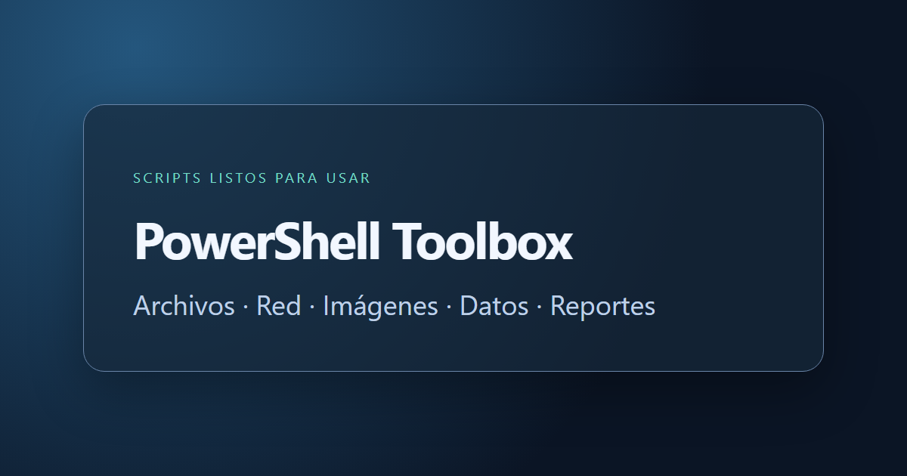

# PowerShell Toolbox



Una colección pequeña de scripts PowerShell para tareas que se repiten: inspeccionar archivos, diagnosticar conexiones y generar evidencia visual. Cada herramienta se puede ejecutar por separado; no hay instalador ni módulo obligatorio.

**[English documentation](README.en.md)** · [Licencia MIT](LICENSE)

## Catálogo

| Herramienta | Para qué sirve | Requisito |
| --- | --- | --- |
| [Get-TextEncoding](scripts/files/Get-TextEncoding.ps1) | Detecta BOM Unicode y valida UTF-8 sin adivinar la codificación heredada | PowerShell 7+ |
| [Get-TcpConnections](scripts/network/Get-TcpConnections.ps1) | Lista conexiones TCP como objetos filtrables y exportables | Windows, `Get-NetTCPConnection` |
| [Convert-HtmlToPng](scripts/web/Convert-HtmlToPng.ps1) | Captura HTML local con Edge o Chrome en modo headless | Edge o Chrome |
| [Compare-Png](scripts/images/Compare-Png.ps1) | Mide cambios píxel a píxel y crea una imagen de diferencias | Windows, PowerShell 7+ |
| [Test-OdbcConnection](scripts/data/Test-OdbcConnection.ps1) | Comprueba un DSN, la arquitectura de PowerShell y el tiempo de conexión | Controlador ODBC compatible |
| [Get-CrystalReportInventory](scripts/reports/Get-CrystalReportInventory.ps1) | Enumera parámetros, tablas y subreportes de archivos `.rpt` | Runtime SAP Crystal Reports de la misma arquitectura |

## Prueba rápida

Desde la raíz del repositorio, en PowerShell 7:

```powershell
./scripts/files/Get-TextEncoding.ps1 -Path ./README.md
./scripts/network/Get-TcpConnections.ps1 -State Established -IncludeProcessName |
    Select-Object -First 10
./scripts/web/Convert-HtmlToPng.ps1 -Html ./examples/demo.html -Width 1200 -Height 630
./scripts/images/Compare-Png.ps1 -Reference ./examples/demo.png -Current ./examples/demo.png
```

Ejemplos para entornos con datos propios:

```powershell
./scripts/data/Test-OdbcConnection.ps1 -Dsn ExampleDsn -Credential (Get-Credential)
./scripts/reports/Get-CrystalReportInventory.ps1 -Path ./reports -Output ./.local/inventory.json
```

`ExampleDsn`, `./reports` y `./.local` son valores de ejemplo. Cree la carpeta de salida antes de exportar. Los archivos de inventario pueden contener nombres de tablas, ubicaciones y prompts: guárdelos fuera del repositorio o bajo `.local/`, que Git ignora. No ponga contraseñas en scripts ni en el historial de comandos.

## Diseño

- Las herramientas de inspección devuelven objetos PowerShell para poder encadenar `Where-Object`, `Export-Csv` y `ConvertTo-Json`.
- Las herramientas que escriben imágenes requieren una ruta explícita o utilizan el nombre del HTML. Evitan sobrescribir archivos salvo con `-Force`.
- La detección de texto indica `Unknown` cuando los bytes no permiten identificar una codificación con seguridad.
- El inventario Crystal requiere su runtime; no incluye bibliotecas de terceros en este repositorio.

Estos scripts fueron adaptados de utilidades de trabajo y reescritos para uso general. El repositorio contiene solo código, documentación y un HTML ficticio; no contiene configuraciones, resultados ni datos de clientes.

## Comprobación y contribuciones

```powershell
./tests/Smoke.ps1
```

La prueba comprueba la sintaxis, la detección de codificación y la comparación de imágenes en Windows. Para proponer otra herramienta, vea [CONTRIBUTING.md](CONTRIBUTING.md).
